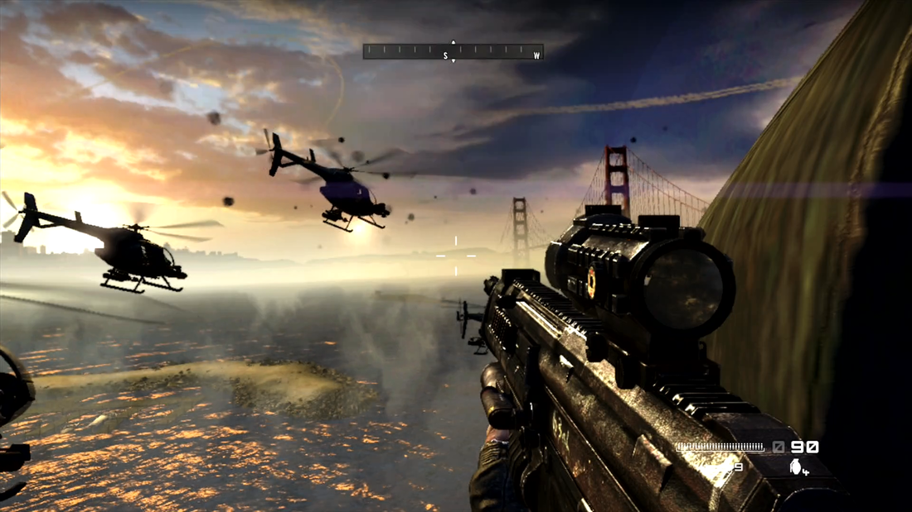

<div align="center">




<br><br>


<br>

<p>
  
  
  
</p>

<p>
  <a href="https://github.com/Frosty-Dev-Xbox/Digital-Den-360/stargazers"></a>
  <a href="https://github.com/Frosty-Dev-Xbox/Digital-Den-360/network/members"></a>
  <a href="https://github.com/Frosty-Dev-Xbox/Digital-Den-360/watchers"></a>
  <a href="https://github.com/Frosty-Dev-Xbox/Digital-Den-360/issues"></a>
</p>

</div>

---

<div align="center">


> ### 💗 **Digital Den 360 is currently in development.**
> Not live yet. Star the repo to get notified when the beta drops.

</div>

---

<div align="center">

## 

</div>

**Digital Den 360** is a homebrew store for jailbroken Xbox 360 consoles. Browse and **download games, emulators, utilities, and themes directly to your console** — no PC required.

<table align="center">
<tr>
<td align="center" width="33%">🎮<br><span style="color:#FF1493;"><b>GAMES</b></span><br>Xbox 360 Ganes To Download To Your Console Without The Need Of Usbs</td>
<td align="center" width="33%">🕹️<br><span style="color:#FF69B4;"><b>EMULATORS</b></span><br>Retro consoles on your 360</td>
<td align="center" width="33%">🛠️<br><span style="color:#FF1493;"><b>UTILITIES</b></span><br>Dashboards, tools, patches</td>
</tr>
<tr>
<td align="center" width="33%">🎨<br><span style="color:#FF69B4;"><b>THEMES</b></span><br>Custom dashboard skins</td>
<td align="center" width="33%">📦<br><span style="color:#FF1493;"><b>ONE-CLICK</b></span><br>Downloads to console</td>
<td align="center" width="33%">🔄<br><span style="color:#FF69B4;"><b>AUTO-UPDATES</b></span><br>Manifest stays fresh</td>
</tr>
</table>

---

<div align="center">

## 


</div>

| **TIER** | **PRICE** | **WHAT YOU GET** |
|:---:|:---:|:---|
| 🆓 **Free** | **£0** | Standard catalog · Games, emulators, utilities · Basic themes · Auto-updates |
| ⚡ **Beta Access** | **£2.99** *per beta* | Access to that beta cycle · Early preview · Beta den builds · Vote on features |
| ✦ **Premium** | **£9.99** *one-time / year* | **Everything in Free** + 12 months access · Early access drops · Exclusive games · Premium themes · Priority servers · Cloud save sync · Premium badge |
| 👑 **Founder** | **£24.99** *one-time* | **Everything in Premium** + Lifetime access · Founder badge · Name in credits · Early dev builds · Founder Discord · Vote on core features |

### 🔓 Store Access Comparison

| **Section** | 🆓 Free | ⚡ Beta | ✦ Premium | 👑 Founder |
|:---|:---:|:---:|:---:|:---:|
| Standard Catalog | ✅ | ✅ | ✅ | ✅ |
| Games / Emulators / Utilities | ✅ | ✅ | ✅ | ✅ |
| Basic Themes | ✅ | ✅ | ✅ | ✅ |
| Auto-Updates | ✅ | ✅ | ✅ | ✅ |
| Beta Cycle Access | ❌ | ✅ | ❌ | ❌ |
| Early Access Drops | ❌ | ❌ | ✅ | ✅ |
| Exclusive Premium Games | ❌ | ❌ | ✅ | ✅ |
| Premium Theme Packs | ❌ | ❌ | ✅ | ✅ |
| Priority Download Servers | ❌ | ❌ | ✅ | ✅ |
| Cloud Save Sync | ❌ | ❌ | ✅ | ✅ |
| Premium Badge | ❌ | ❌ | ✅ | ✅ |
| **Lifetime Access** | ❌ | ❌ | ❌ | ✅ |
| Founder Badge (Forever) | ❌ | ❌ | ❌ | ✅ |
| Name in Credits | ❌ | ❌ | ❌ | ✅ |
| Early Dev Builds | ❌ | ❌ | ❌ | ✅ |
| Founder Discord | ❌ | ❌ | ❌ | ✅ |
| Vote on Core Features | ❌ | ❌ | ❌ | ✅ |

---

<div align="center">

## 

| **PHASE** | **STATUS** | **DESCRIPTION** |
|:---:|:---:|:---|
| 🛠️ **Phase 1** |  | Building the den, script, and manifest |
| ✦ **Phase 2** |  | Premium Beta — early access |
| 🆓 **Phase 3** |  | Free public release |

</div>

---

<div align="center">

## 

</div>

```diff
+ ①  Add the Digital Den 360 manifest URL to your Aurora dashboard
+ ②  Launch Digital Den 360 from your scripts menu
+ ③  Browse the catalog — games, emus, tools
+ ④  Hit download — it installs straight to your console
+ ⑤  Play. No PC required.
```

> ⚠️ **Requires a jailbroken 360** — RGH, JTAG, or BadUpdate. All fully supported.

---

<div align="center">

## 

| **Console / Method** | **Status** |
|:---|:---:|
| RGH 1.2 / 2.0 / 3.0 |  |
| JTAG |  |
| BadUpdate |  |
| Stock (unmodded) |  |

</div>

---

<div align="center">

## 

<br>


<br>


</div>

---

<div align="center">

## 

</div>

<details>
<summary><span style="color:#FF1493;"><strong>Is Digital Den 360 legal?</strong></span></summary>
Yes. Digital Den 360 only hosts homebrew and open-source content. No retail games, no XBLA, no piracy. Ever.
</details>

<details>
<summary><span style="color:#FF1493;"><strong>Do I need a modded console?</strong></span></summary>
Yes. You need a jailbroken Xbox 360 — RGH, JTAG, or BadUpdate. All three are fully supported.
</details>

<details>
<summary><span style="color:#FF1493;"><strong>Is this a subscription?</strong></span></summary>
No. Every payment is one-time. No monthly charges, no auto-renew. Premium gives 12 months access for one payment.
</details>

<details>
<summary><span style="color:#FF1493;"><strong>What is Beta Access?</strong></span></summary>
Beta Access is £2.99 per beta cycle. Each new beta release has its own access payment.
</details>

<details>
<summary><span style="color:#FF1493;"><strong>Is Founder really lifetime?</strong></span></summary>
Yes. Founder is £24.99 once — lifetime access plus Founder badge, name in credits, early dev builds, Founder Discord, and vote on core features. Limited to 100 spots.
</details>

<details>
<summary><span style="color:#FF1493;"><strong>What happens when Premium expires?</strong></span></summary>
You drop back to the Free tier. No auto-charge. You can buy another year or upgrade to Founder anytime.
</details>

<details>
<summary><span style="color:#FF1493;"><strong>Can I submit my own homebrew?</strong></span></summary>
Absolutely. Submit via GitHub once the den goes live.
</details>

<details>
<summary><span style="color:#FF1493;"><strong>Who made Digital Den 360?</strong></span></summary>
Built by [Frosty-Dev-Xbox](https://github.com/Frosty-Dev-Xbox). A passion project for the homebrew community.
</details>

---

<div align="center">

## 

**Digital Den 360 only hosts homebrew and open-source content.**

<span style="color:#FF1493;">**No retail games.**</span> <span style="color:#FF69B4;">**No XBLA.**</span> <span style="color:#FF1493;">**No piracy.**</span> **Ever.**

</div>

---

<div align="center">

## 

<br>

<a href="https://frosty-dev-xbox.github.io/Digital-Den-360-Web">
  
</a>

</div>

---

<div align="center">


<br><br>

<a href="https://github.com/Frosty-Dev-Xbox"></a>
<a href="https://github.com/Frosty-Dev-Xbox/Digital-Den-360"></a>
<a href="https://github.com/Frosty-Dev-Xbox/Digital-Den-360/blob/main/LICENSE"></a>

<br><br>


</div>
 
